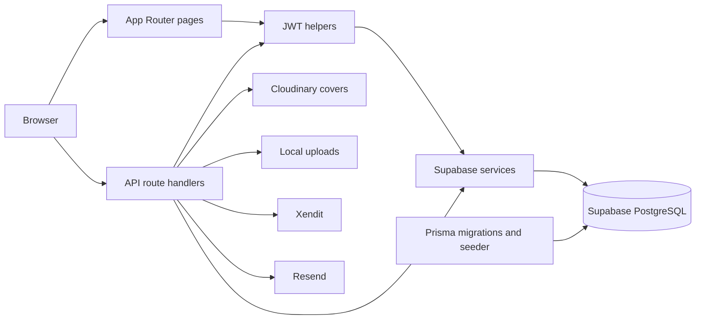

# Application architecture

dotload is a Next.js App Router application. Pages, API handlers, and server utilities live in one repository. This map describes existing behavior; it does not introduce architecture decisions or certify security.

## Request and storage boundaries

Sources: [services](../lib/supabase-db.ts), [schema](../prisma/schema.prisma), [product creation](../app/api/products/route.ts), [file upload](../app/api/products/[id]/files/route.ts), [payments](../lib/xendit-client.ts), and [email](../lib/email.ts). The diagram shows principal paths, not a uniform policy for every handler.

## Code map

| Area | Entry points |
| --- | --- |
| Seller pages | `app/dashboard/`, `app/products/`, `app/settings/`, `app/transactions/` |
| Public product and checkout | `app/p/[slug]/`, including checkout, success, failure, and content pages |
| Buyer pages | `app/buyer-dashboard/`, `app/purchases/` |
| Endpoints | `app/api/**/route.ts`; see [inventory](api.md) |
| UI | `components/`, with shared primitives in `components/ui/` |
| Server services | `lib/` |
| Database definitions | `prisma/schema.prisma`, `prisma/migrations/` |
| Tests | `tests/backend/`, `tests/frontend/`, `tests/integration/`, `tests/lib/` |

## Database ownership

[Supabase services](../lib/supabase-db.ts) define operations for users, products, files, variations, purchases, and transactions. They query application tables with an admin client created using the service role key.

[Prisma](../lib/prisma.ts), [the schema](../prisma/schema.prisma), and migrations form another database path. [The seeder](../scripts/seed-test-data.ts) uses Prisma directly. Application routes using Supabase do not inherit a local database fallback from [lib/database.ts](../lib/database.ts).

The schema defines these relationships:

- A `User` owns products, purchases, payouts, and transactions.
- A `Product` has files, variations, and purchases.
- A `Purchase` references a product and optionally a user, and has a unique access code.
- A `FileDownload` references a file and optionally a purchase.

Product options and several metadata fields use strings. Monetary fields such as `price` and `amount` use `Float`. Status fields use strings rather than Prisma enums. Lowercase `users` and `chat_history` models also exist separately from the application `User` model.

## Authentication

[Registration](../app/api/auth/register/route.ts) accepts multipart form data and hashes passwords with bcrypt. [Login](../app/api/auth/login/route.ts) issues a `token` cookie. [Middleware](../middleware.ts) verifies HS256 JWTs only for routes in its `matcher`. It redirects missing or invalid sessions to login and tokens with `emailVerified === false` to verification.

Middleware does not match every API endpoint. Read route-specific checks as well. [Auth utilities](../lib/auth-utils.ts) read the token cookie, optionally read a bearer token when supplied a request, and resolve users through Supabase. Other handlers verify tokens independently.

## File storage

[Product creation](../app/api/products/route.ts) sends covers to Cloudinary. [File upload](../app/api/products/[id]/files/route.ts) writes downloadable content below `uploads/users/{userId}/products/{productId}/files` and stores relative paths in `File.path`.

[File utilities](../lib/file-utils.ts) try several candidate locations and can search the uploads directory. Multiple download routes coexist, including purchase access and HMAC token routes. Their authentication and expiration rules must be traced independently.

## Purchases and payments

[Purchase utilities](../lib/purchase-utils.ts) create pending purchases with access codes through Supabase. Payment handlers call [Xendit helpers](../lib/xendit-client.ts). `/api/payments/webhook` and `/api/webhooks/xendit` are separate handlers with different event and authentication logic.

[Transaction utilities](../lib/transaction-utils.ts) use the Supabase transaction service. [Payouts](../app/api/payouts/route.ts) derives data from transactions, while the schema also defines a separate `Payout` model. Do not assume those paths are interchangeable.

See [operations](operations.md) for observed webhook, fee, storage, and build gaps.
